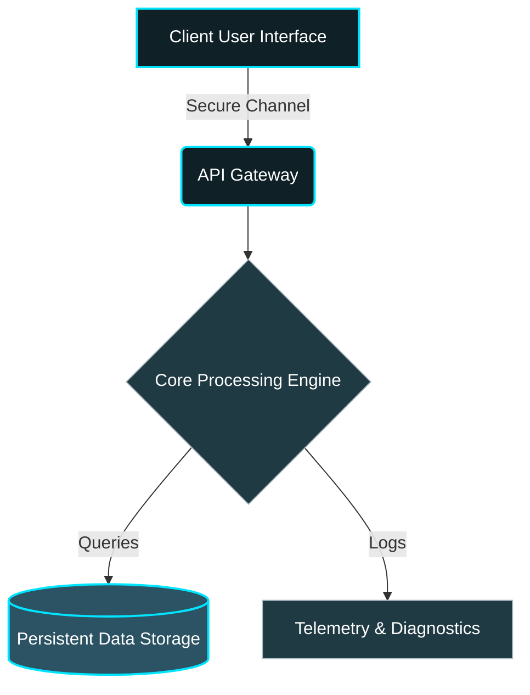

![Header](data:image/svg+xml;base64,PHN2ZyB3aWR0aD0iODAwIiBoZWlnaHQ9IjIwMCIgdmlld0JveD0iMCAwIDgwMCAyMDAiIHhtbG5zPSJodHRwOi8vd3d3LnczLm9yZy8yMDAwL3N2ZyI+CiAgPGRlZnM+CiAgICA8bGluZWFyR3JhZGllbnQgaWQ9ImdyYWQiIHgxPSIwJSIgeTE9IjAlIiB4Mj0iMTAwJSIgeTI9IjEwMCUiPgogICAgICA8c3RvcCBvZmZzZXQ9IjAlIiBzdG9wLWNvbG9yPSIjMGYyMDI3IiAvPgogICAgICA8c3RvcCBvZmZzZXQ9IjUwJSIgc3RvcC1jb2xvcj0iIzIwM2E0MyIgLz4KICAgICAgPHN0b3Agb2Zmc2V0PSIxMDAlIiBzdG9wLWNvbG9yPSIjMmM1MzY0IiAvPgogICAgPC9saW5lYXJHcmFkaWVudD4KICAgIDxmaWx0ZXIgaWQ9Imdsb3ciIHg9Ii0yMCUiIHk9Ii0yMCUiIHdpZHRoPSIxNDAlIiBoZWlnaHQ9IjE0MCUiPgogICAgICA8ZmVHYXVzc2lhbkJsdXIgc3RkRGV2aWF0aW9uPSI1IiByZXN1bHQ9ImJsdXIiIC8+CiAgICAgIDxmZUNvbXBvc2l0ZSBpbj0iU291cmNlR3JhcGhpYyIgaW4yPSJibHVyIiBvcGVyYXRvcj0ib3ZlciIgLz4KICAgIDwvZmlsdGVyPgogIDwvZGVmcz4KICA8cmVjdCB3aWR0aD0iMTAwJSIgaGVpZ2h0PSIxMDAlIiBmaWxsPSJ1cmwoI2dyYWQpIiByeD0iMTUiIHJ5PSIxNSIvPgogIAogIDx0ZXh0IHg9IjUwJSIgeT0iNDAlIiBmb250LWZhbWlseT0iQXJpYWwsIHNhbnMtc2VyaWYiIGZvbnQtd2VpZ2h0PSJib2xkIiBmb250LXNpemU9IjQyIiBmaWxsPSIjMDBlNWZmIiB0ZXh0LWFuY2hvcj0ibWlkZGxlIiBmaWx0ZXI9InVybCgjZ2xvdykiIHN0eWxlPSJ0ZXh0LXRyYW5zZm9ybTogdXBwZXJjYXNlOyBsZXR0ZXItc3BhY2luZzogNHB4OyI+CiAgICBnZXN0dXJlIDNkIHdlYgogIDwvdGV4dD4KICAKICA8dGV4dCB4PSI1MCUiIHk9IjY1JSIgZm9udC1mYW1pbHk9IkFyaWFsLCBzYW5zLXNlcmlmIiBmb250LXNpemU9IjE2IiBmaWxsPSIjYjBiZWM1IiB0ZXh0LWFuY2hvcj0ibWlkZGxlIiBzdHlsZT0ibGV0dGVyLXNwYWNpbmc6IDJweDsiPgogICAgTkVYVC1HRU4gVFlQRVNDUklQVCBBUkNISVRFQ1RVUkUKICA8L3RleHQ+CgogIDwhLS0gQW5pbWF0ZWQgbGluZSAtLT4KICA8bGluZSB4MT0iMjAwIiB5MT0iMTYwIiB4Mj0iNjAwIiB5Mj0iMTYwIiBzdHJva2U9IiMwMGU1ZmYiIHN0cm9rZS13aWR0aD0iMiIgZmlsdGVyPSJ1cmwoI2dsb3cpIj4KICAgIDxhbmltYXRlIGF0dHJpYnV0ZU5hbWU9IngxIiB2YWx1ZXM9IjIwMDsgMzAwOyAyMDAiIGR1cj0iM3MiIHJlcGVhdENvdW50PSJpbmRlZmluaXRlIiAvPgogICAgPGFuaW1hdGUgYXR0cmlidXRlTmFtZT0ieDIiIHZhbHVlcz0iNjAwOyA1MDA7IDYwMCIgZHVyPSIzcyIgcmVwZWF0Q291bnQ9ImluZGVmaW5pdGUiIC8+CiAgPC9saW5lPgo8L3N2Zz4=)

 

  
  
  
  

*An advanced software structure developed by Karthik Idikuda.*

---

## Overview

> A cutting-edge implementation designed for high-performance operations, scalability, and seamless integration.

Welcome to **gesture 3d web**. This repository houses the source code for a next-generation system engineered to push the boundaries of modern software development. It leverages advanced design patterns to ensure reliability and speed.

 

## System Architecture

The below diagram illustrates the high-level data flow and component interaction within the system.

### Component Breakdown
- **Client Interface:** The primary point of interaction, optimized for responsiveness.
- **API Gateway:** Routes and authenticates incoming requests securely.
- **Core Engine:** The brain of the operation, executing complex domain logic and algorithms.
- **Persistent Storage:** A highly available data store ensuring data integrity.
- **Telemetry:** Continuous monitoring and logging for proactive maintenance.

 

## Technical Specifications

| Metric | Specification |
|:---|:---|
| **Primary Language** | `TypeScript` |
| **Frameworks** | `Standard Library / Native Dependencies` |
| **Code Structure** | `Modular / Microservice-ready` |
| **Security** | `End-to-End Encryption / Token Auth` |

 

## Deployment & Initialization

To initialize this system in your local or cloud environment, standard build procedures for `TypeScript` apply. Ensure all environment variables and dependencies are securely configured prior to execution.

 

## License & Attribution

This project is open-sourced under the **MIT License**. Permission is granted for use, modification, and distribution as per the license terms.

---

  

